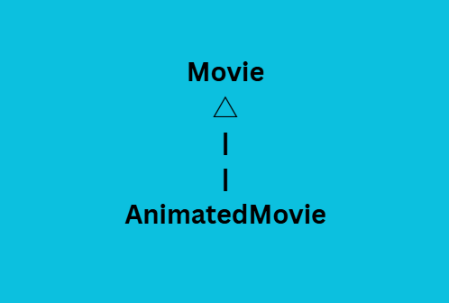
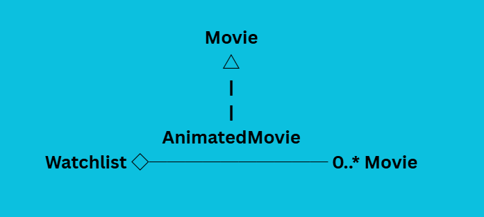
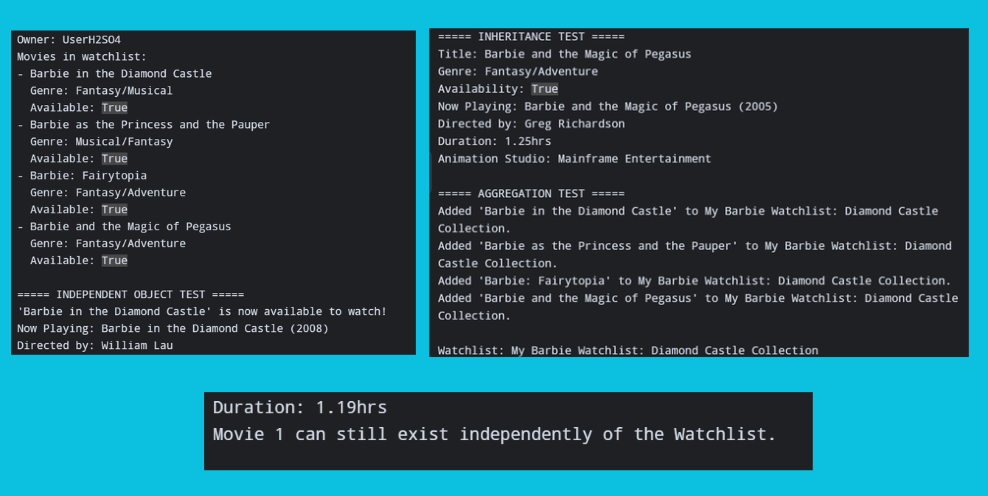
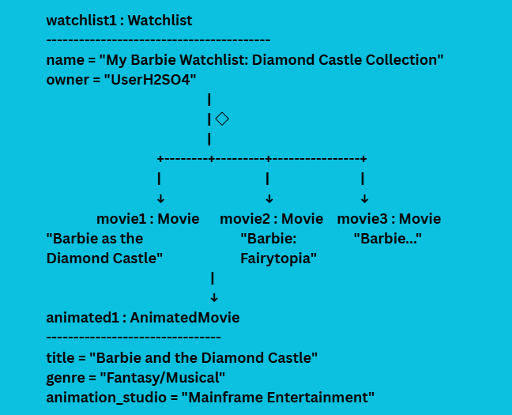

# Advanced Class Relationships
## Previous Activities
[classAttrib](classAttributesMethods.md)
[classRel](classRelationships.md)
## Existing System Description: My existing system consists of two classes: Movie and Watchlist. The Movie class represents a movie and contains attributes such as title, genre, availability, director, year, and duration. It also has methods such as playback(), present(), and release(). The Watchlist class represents a collection of movies and can contain zero or more Movie objects.
## Inheritance Relationship
Parent: Movie
Child: AnimatedMovie
Explanation: AnimatedMovie is a type of Movie because it has the same basic characteristics as a regular movie. It has a title, genre, availability, director, year, and duration. It can also use the methods inherited from the Movie class, such as playback(), present(), and release(). The AnimatedMovie class adds an animation_studio attribute and a show_studio() method for information specific to animated movies.
## Inheritance UML

## Composition/Aggregation
Relationship: Aggregation
Explanation: The relationship between Watchlist and Movie is aggregation because a Watchlist contains Movie objects, but the Movie objects can exist independently. In my program, the Movie objects are created before they are added to the Watchlist. This means the Watchlist does not create or own the entire lifetime of the Movie objects. If the Watchlist is removed, the Movie objects can still exist independently.
## Advanced UML Diagram

## Python Implementation
[Source Code](advancedRelationships.py)
## Test Run

## Object Diagram

## Reflection
Answers:
1. I chose Movie as the parent class and AnimatedMovie as the child class because an animated movie is a type of movie. Both classes share common characteristics such as title, genre, availability, director, year, and duration. AnimatedMovie can use the methods of Movie while also having its own additional feature, animation_studio. This makes AnimatedMovie an appropriate child class of Movie.
2. Inheritance reduced duplicate code because I did not have to rewrite the common Movie attributes and methods in the AnimatedMovie class. The child class reuses attributes such as title, genre, and availability from Movie. It also inherits methods such as playback(), present(), and release(). I used super().__init__() to reuse the constructor from the parent class.
3. My HAS-A relationship is aggregation because the Watchlist contains Movie objects that can exist independently. The Movie objects are created separately before they are added to the Watchlist. This means the Watchlist does not control the entire lifetime of the Movie objects. Therefore, deleting the Watchlist would not mean that the Movie objects must also be deleted.
4. In Part III, I used Association to show that a Watchlist is connected to Movie objects. In Part IV, I represented this relationship more specifically as Aggregation because the Movie objects can exist independently from the Watchlist. I also added Inheritance between Movie and AnimatedMovie, which represents an IS-A relationship. These advanced relationships give more information about how the objects are connected.
5. My design follows the DRY principle because the common movie attributes and methods are written only once in the Movie class. AnimatedMovie inherits these features instead of repeating the same code. The child class only adds the attribute and method that are specific to animated movies. This reduces duplicate code and makes the system easier to maintain.
