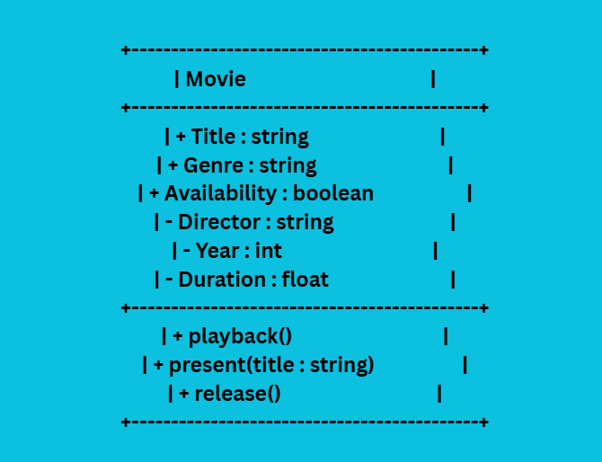
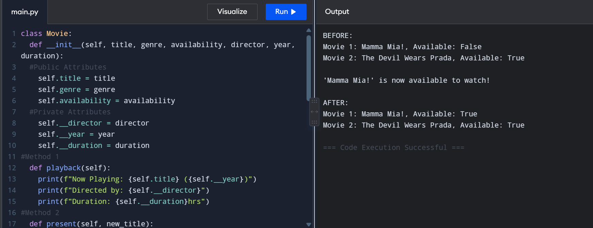
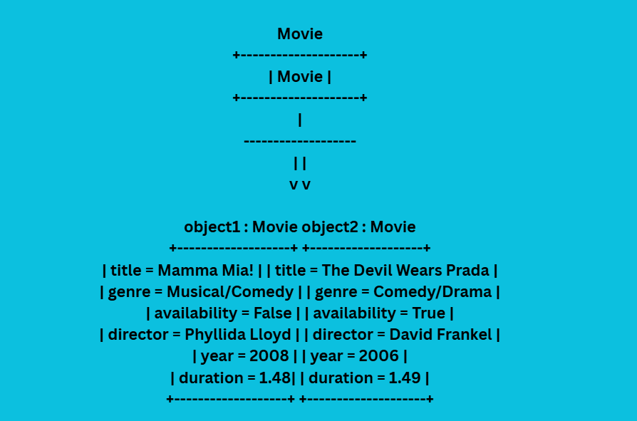

# Class Attributes and Methods
## Previous Design
Link to my previous activity:
[classObjectUML.md](classObjectUML.md)
## Design Revision
Describe any changes made to your original class.
## Visibility Decisions
| Attribute | Data Type | Visibility | Reason |
|---|---|---|---|
|Title|string|Public|It is the most unique attribute of an object.|
|Director|string|Private|Not every viewer pays attention to the Director of a movie.
|Genre|string|Public|Viewers need to know what type of movie they are watching.|
|Year|int|Private|Not every viewer pays attention to when the movie was released.|
|Duration|float|Private|Not every viewer is concerned about how long the movie is.|
|Availability|boolean|Public|It tells whether the movie is available to watch or not.|
## Updated UML Class Diagram

## Python Implementation
[View Python Source](classImplementation.py)
## Test Run

## Object Diagram

## Analysis
### I made my chosen attribute private because it is the information that should not be changed by other parts of the program. It is one of the most unique attributes of the object. If it changes, the movie will have incorrect information about its director.
### The release() method changes the availability of the movie. It sets self.availability from False to True. In my program, movie1.release() showed a message that it is available to watch, which indicates that the availability changed from False to True.
### Changing Movie 1 did not change Movie 2. In the first output, Movie 1 was unavailable, while Movie 2 was available. When Movie 1 is released, it became available, while Movie 2 remained.
### A class diagram shows the blueprint of the Movie class, including its attributes and methods, such as title, genre, playback(), and release(). An object diagram shows actual objects created from that class, such as movie1 and movie2, along with their specific values. For example, both objects are Movies, but movie1 has the title "Mamma Mia!" while movie2 has the title "The Devil Wears Prada."
