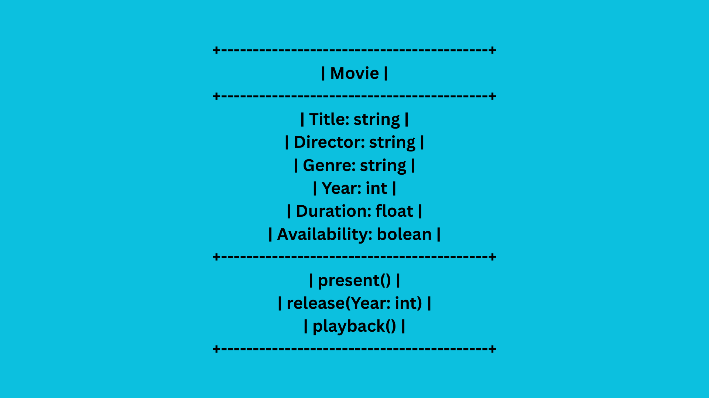

# SG4 - Understanding Classes and Objects
## Class Name
## Class Description
## Properties
| Property | Data Type | Description |
|---|---|---|
|Title|string|Title of the movie|
|Director|string|Director of the movie|
|Genre|string|Genre of the movie|
|Year|int|The year of the movie's release|
|Duration|float|The duration of the movie|
|Availability|boolean|Tells if the movie is available|
## Methods
| Method | Description |
|---|---|
|present|presents the movie if available|
|release|releases the movie by a date|
|playback|plays the movie by a duration of time|
## Class Diagram

### I chose this class because I love movies. I enjoy watching and analyzing them so I believe I have a lot to input in this activity.
### The most important property is the title because it tells the most commonly observed specificity of a class.
### The most important method is the playback because it does the most common purpose of a movie, which is to play it and allow viewers to watch its content.
