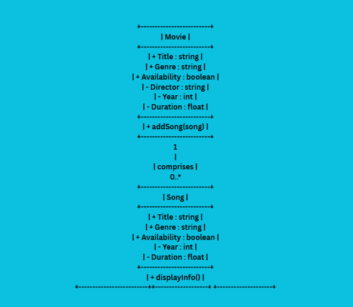
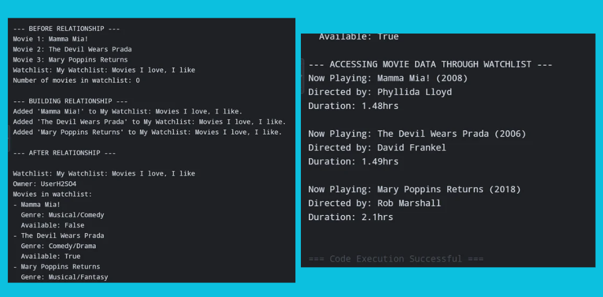
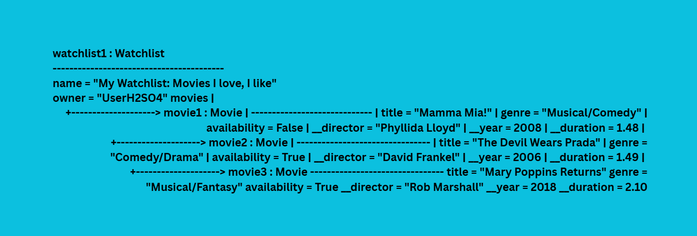

# Class Relationships: Association and Multiplicity
## Previous Work
[Part I - Classes and Objects](classObjectUML.md)
[Part II - Class Attributes and Methods](classAttributesMethods.md)
## Existing Class
Class: Movie
Description: A movie is a series of visual images shown rapidly in succession to create the illusion of a moving picture, typically telling a story or sharing an idea with sound.
## New Related Class
Class: Watchlist
Description: A Watchlist represents a collection of movies that a user wants to watch. It has its own name and owner, and it can contain multiple Movie objects.
## Association
Relationship: Has-A
Explanation: A watchlist needs actual movies to make up its collection.
## Multiplicity

Multiplicity: 0..*
Explanation: This means one Watchlist can contain zero or more Movie objects. A watchlist can initially be empty, and movies can be added later. This multiplicity also fits the requirement to practice using a Python list to store multiple object references.
## UML Class Relationship Diagram

## Python Implementation
[View Python Source](classRelationships.py)
## Test Run

## Object Relationship Diagram

## Analysis
### My two classes have a title, genre, and their availabilities can be determined.
### I chose 0..* because my classes can have multiple similar attributes.
### I implemented a relationship in python by connecting two classes through their similar attributes.
### Why did you store an object reference instead of copying its data?
### A list is appropriate for a many relationship because it groups multiple connected items together in a single container.
